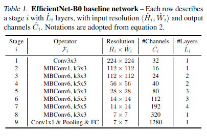
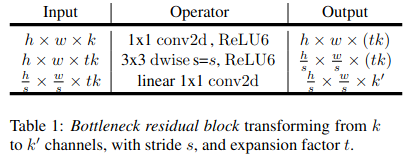
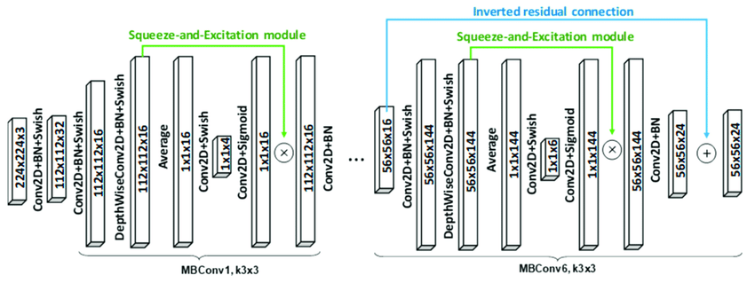
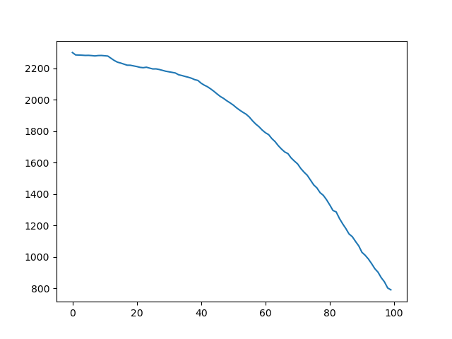
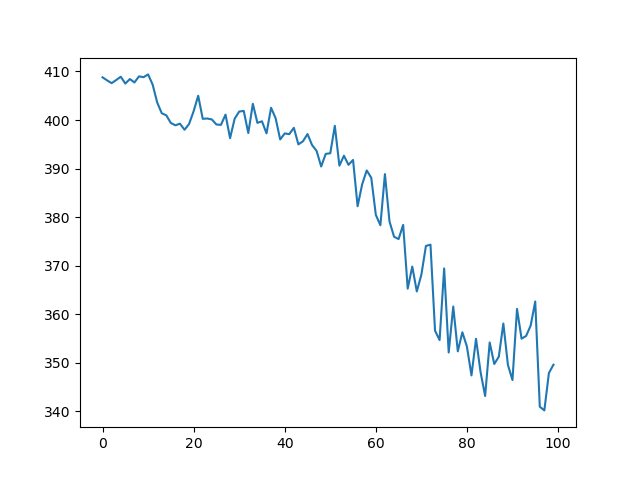
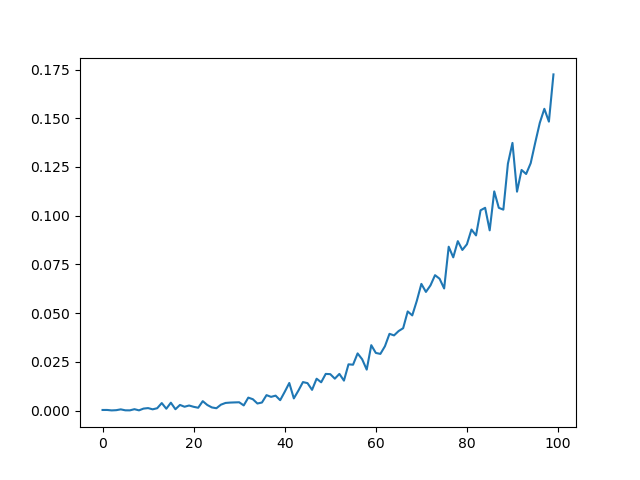
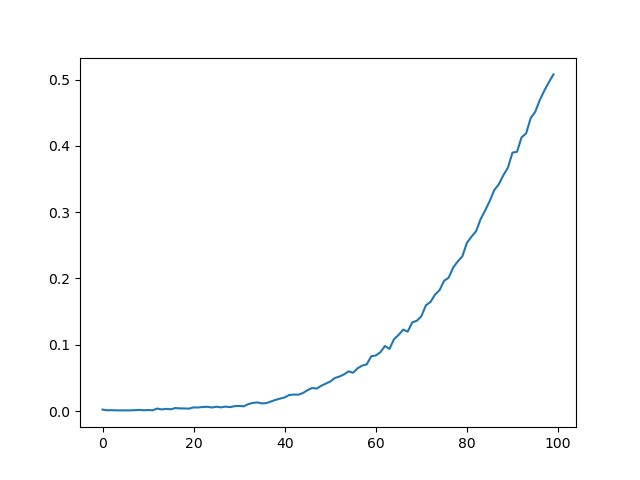

# Deep Learning Method Implementaion for Image Car Model Classification

В лабораторой работе

## EfficientNet

Начнём с архитектуры EfficientNet **[1]**. Основной её строительные блоки это *MBConv*.

*MbConv* -- это слой, впервые представленный в статье по MobileNetV2. Данный слой состоит из свёрточного слоя $1 \times 1$ с $tk$ фильтрами, где $k$ -- это количество входных слоёв, а $t$ -- фактор расширения (гиперпараметр). Полученный результат отправляется в слой активации после чего передаётся в depthwise свёрточный слой $H \times W$ с $tk$ фильтрами ($H$ и $W$ гиперпараметры). Результат затем обрабатывается в слое активации и передаётся в свёртку $1 \times 1$ с $k'$ фильтрами ($k'$ гиперпараметр).

В *EfficientNet* в качестве функции активации используется *SiLU*.

Также в реализации *MBConv*, предаставленной в *EfficientNet*, добавлен squeeze and excitation block перед последним свёрточным слоем.

Помимо этого В MBConv, предствленной в *EfficientNet*, используется концепция остаточного слоя (residual connection).
Однако за счет наличия остаточных слоев предполагается не только
сохранять валидные градиенты (обычное использование), но также и случайным образом отключать содержательные слои, изменяя при этом глубину сети во время обучения.

Также в *EfficientNet* применяется батч нормализация после каждого свёрточного слоя.

После всех свёрточных сетей используется average pooling для дальнейшей передачи в полносвязные слои, которые выступают в роли классификатора.

## NAdam

NAdam является примером применения моментов нестерова к оптимизатору Adam. Моменты подсчитываются не в точке рассчета градиентов, а как-бы опережают спуск на шаг

## Результаты

### Реализация EfficientNet на Numpy (Cupy)
Время расчёта одной тренировочной эпохи реализации на *Numpy* (*Cupy*) вышло ~8 часов. (С реализацией сверток на циклах ~11ч.)

## Реализация на Pytorch

Loss Train:

Loss Test:

F1 Train:

F1 Test:

По графикам Train Loss и Val Loss можно заметить, что модель не была склонна к переобучению на обучающей выборке. 

## Источники
1. Tan M., Le Q. Efficientnet: Rethinking model scaling for convolutional neural networks //International conference on machine learning. – PMLR, 2019. – С. 6105-6114.
2. Sandler M. et al. Mobilenetv2: Inverted residuals and linear bottlenecks //Proceedings of the IEEE conference on computer vision and pattern recognition. – 2018. – С. 4510-4520.
3. Hu J., Shen L., Sun G. Squeeze-and-excitation networks //Proceedings of the IEEE conference on computer vision and pattern recognition. – 2018. – С. 7132-7141.
4. Kingma D. P., Ba J. Adam: A method for stochastic optimization //arXiv preprint arXiv:1412.6980. – 2014.
5. Dozat T. Incorporating nesterov momentum into adam. – 2016.